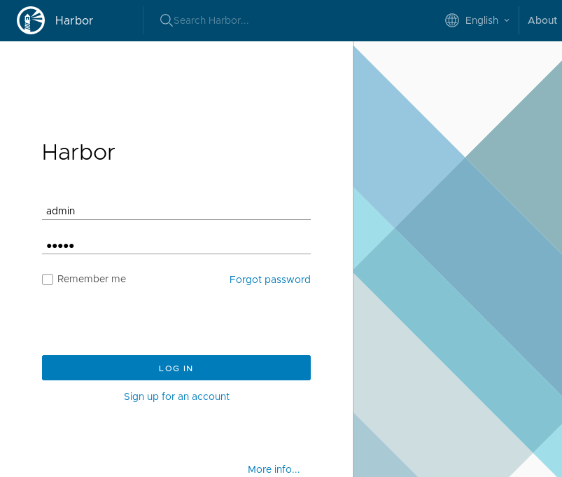
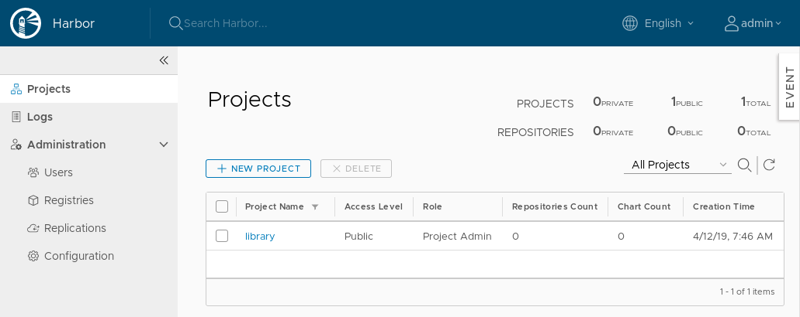

# Patroni

Install PostgreSQL database using Partoni Helm Chart:

```bash
helm repo add incubator https://kubernetes-charts-incubator.storage.googleapis.com
helm install incubator/patroni --name patroni --namespace patroni --version 0.14.0 --wait \
  --set credentials.admin="admin" \
  --set credentials.standby="standby" \
  --set credentials.superuser="superuser" \
  --set replicaCount="2"
```

Allow access to the database using Istio:

```bash
cat << EOF | kubectl apply -f -
apiVersion: networking.istio.io/v1alpha3
kind: Gateway
metadata:
  name: patroni-gateway
  namespace: patroni
spec:
  selector:
    istio: ingressgateway
  servers:
  - port:
      number: 5432
      name: pgsql-patroni-cluster
      protocol: TCP
    hosts:
    - pgsql.${MY_DOMAIN}
---
apiVersion: networking.istio.io/v1alpha3
kind: VirtualService
metadata:
  name: patroni-virtual-service
  namespace: patroni
spec:
  hosts:
  - pgsql.${MY_DOMAIN}
  gateways:
  - patroni-gateway
  tcp:
  - match:
    - port: 5432
    route:
    - destination:
        host: patroni.patroni.svc.cluster.local
        port:
          number: 5432
EOF
```

```bash
kubectl get pods -l spilo-role -L spilo-role
```

```bash
kubectl get endpoints -o yaml
```

## pgAdmin - PostgreSQL Tools

Add Helm repo and install pgAdmin:

```bash
helm repo add cetic https://cetic.github.io/helm-charts
helm install --name pgadmin --namespace pgadmin --version 0.1.9 --wait cetic/pgadmin \
  --set persistence.enabled="false" \
  --set pgadmin.password="admin" \
  --set pgadmin.tls="true" \
  --set pgadmin.username="admin" \
  --set servers.config.Servers.1.Group="Servers" \
  --set servers.config.Servers.1.Host="pgsql.${MY_DOMAIN}" \
  --set servers.config.Servers.1.MaintenanceDB="postgres" \
  --set servers.config.Servers.1.Name="Patroni PGSQL - external" \
  --set servers.config.Servers.1.Port="5432" \
  --set servers.config.Servers.1.SSLMode="prefer" \
  --set servers.config.Servers.1.Username="postgres" \
  --set servers.config.Servers.2.Group="Servers" \
  --set servers.config.Servers.2.Host="patroni.patroni.svc.cluster.local" \
  --set servers.config.Servers.2.MaintenanceDB="postgres" \
  --set servers.config.Servers.2.Name="Patroni PGSQL - internal" \
  --set servers.config.Servers.2.Port="5432" \
  --set servers.config.Servers.2.SSLMode="prefer" \
  --set servers.config.Servers.2.Username="postgres" \
  --set servers.enabled="true" \
  --set service.type="ClusterIP"
```

```bash
cat << EOF | kubectl apply -f -
apiVersion: networking.istio.io/v1alpha3
kind: Gateway
metadata:
  name: pgadmin-gateway
  namespace: pgadmin
spec:
  selector:
    istio: ingressgateway
  servers:
  - port:
      number: 443
      name: https-pgadmin
      protocol: HTTPS
    hosts:
    - pgadmin.${MY_DOMAIN}
    tls:
      mode: PASSTHROUGH
---
apiVersion: networking.istio.io/v1alpha3
kind: VirtualService
metadata:
  name: pgadmin-https-virtual-service
  namespace: pgadmin
spec:
  hosts:
  - pgadmin.${MY_DOMAIN}
  gateways:
  - pgadmin-gateway
  tls:
  - match:
    - port: 443
      sniHosts:
      - pgadmin.${MY_DOMAIN}
    route:
    - destination:
        host: pgadmin.pgadmin.svc.cluster.local
        port:
          number: 443
EOF
sleep 60
```

## Install Harbor


Label Harbor namespace and copy there the secret with certificates signed by
Let's Encrypt certificate:

```bash
kubectl create namespace harbor
kubectl label namespace harbor app=kubed
```

Create Istio Gateways and VirtualServices to allow accessing Harbor from
"outside":

```bash
cat << EOF | kubectl apply -f -
apiVersion: networking.istio.io/v1alpha3
kind: Gateway
metadata:
  name: harbor-gateway
  namespace: harbor
spec:
  selector:
    istio: ingressgateway
  servers:
  - port:
      number: 80
      name: http-harbor
      protocol: HTTP
    hosts:
    - harbor.${MY_DOMAIN}
  - port:
      number: 443
      name: https-harbor
      protocol: HTTPS
    hosts:
    - harbor.${MY_DOMAIN}
    - notary.${MY_DOMAIN}
    tls:
      mode: PASSTHROUGH
---
apiVersion: networking.istio.io/v1alpha3
kind: VirtualService
metadata:
  name: harbor-http-virtual-service
  namespace: harbor
spec:
  hosts:
  - harbor.${MY_DOMAIN}
  gateways:
  - harbor-gateway
  http:
  - match:
    - port: 80
    route:
    - destination:
        host: harbor.harbor.svc.cluster.local
        port:
          number: 80
---
apiVersion: networking.istio.io/v1alpha3
kind: VirtualService
metadata:
  name: harbor-https-virtual-service
  namespace: harbor
spec:
  hosts:
  - harbor.${MY_DOMAIN}
  gateways:
  - harbor-gateway
  tls:
  - match:
    - port: 443
      sniHosts:
      - harbor.${MY_DOMAIN}
    route:
    - destination:
        host: harbor.harbor.svc.cluster.local
        port:
          number: 443
---
apiVersion: networking.istio.io/v1alpha3
kind: VirtualService
metadata:
  name: harbor-notary-virtual-service
  namespace: harbor
spec:
  hosts:
  - notary.${MY_DOMAIN}
  gateways:
  - harbor-gateway
  tls:
  - match:
    - port: 443
      sniHosts:
      - notary.${MY_DOMAIN}
    route:
    - destination:
        host: harbor.harbor.svc.cluster.local
        port:
          number: 4443
EOF
```

Create Harbor's databases in PostgreSQL:

```bash
export PGPASSWORD=superuser
psql -h pgsql.${MY_DOMAIN} --username=postgres << EOF
  CREATE USER "harbor_user" ;
  CREATE DATABASE "harbor" ;
  CREATE DATABASE "harbor-clair" ;
  CREATE DATABASE "harbor-notary_server" ;
  CREATE DATABASE "harbor-registry" ;
  GRANT ALL PRIVILEGES ON DATABASE "harbor"               TO harbor_user ;
  GRANT ALL PRIVILEGES ON DATABASE "harbor-clair"         TO harbor_user ;
  GRANT ALL PRIVILEGES ON DATABASE "harbor-notary_server" TO harbor_user ;
  GRANT ALL PRIVILEGES ON DATABASE "harbor-registry"      TO harbor_user ;
EOF
```

Set password for `harbor_user` in PostgreSQL:

```shell
psql -h pgsql.${MY_DOMAIN} --username=postgres "ALTER USER harbor_user WITH PASSWORD 'harbor_user_password';"
```

Add Harbor Helm repository:

```bash
helm repo add harbor https://helm.goharbor.io
```

Install Harbor using Helm:

```bash
helm install --wait --name harbor --namespace harbor harbor/harbor --version v1.1.3 \
  --set database.external.clairDatabase="harbor-clair" \
  --set database.external.coreDatabase="harbor-registry" \
  --set database.external.host="patroni.patroni.svc.cluster.local" \
  --set database.external.notaryServerDatabase="harbor-notary_server" \
  --set database.external.password="harbor_user_password" \
  --set database.external.sslmode="require" \
  --set database.external.username="harbor_user" \
  --set database.type="external" \
  --set expose.tls.enabled="true" \
  --set expose.tls.secretName="ingress-cert-${LETSENCRYPT_ENVIRONMENT}" \
  --set expose.type="clusterIP" \
  --set externalURL="https://harbor.${MY_DOMAIN}" \
  --set harborAdminPassword="admin" \
  --set persistence.enabled="false"
```

Open the [https://harbor.myexample.dev](https://harbor.myexample.dev):



Log in:

* User: `admin`
* Password: `admin`

You should see the Web UI:


